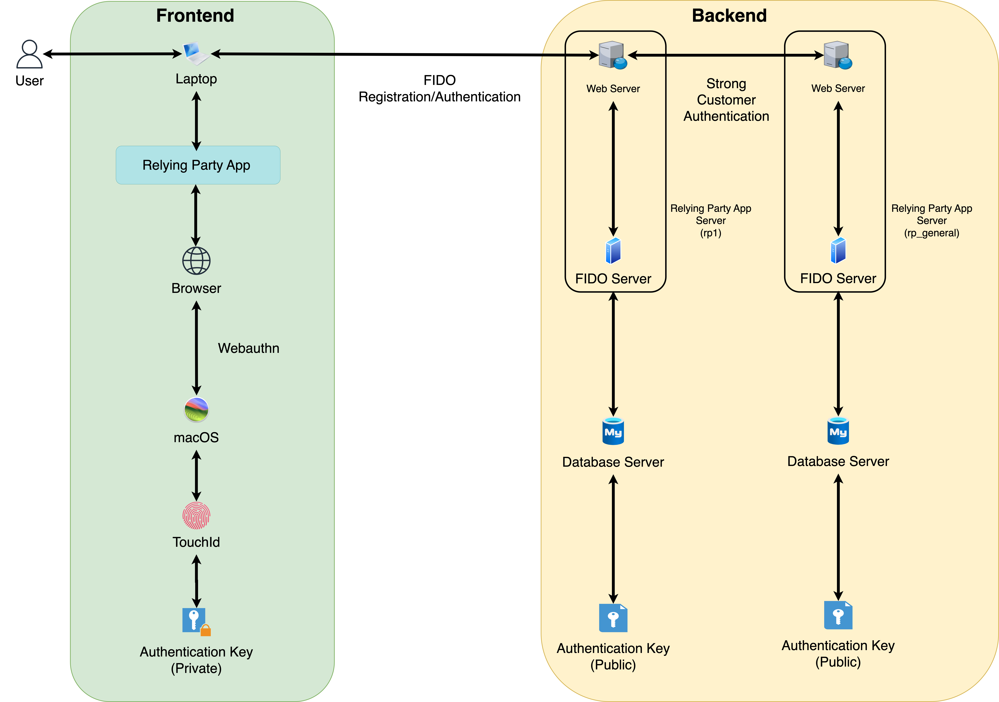
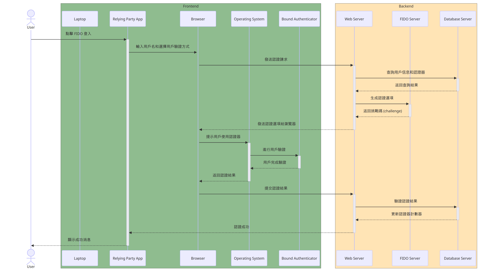
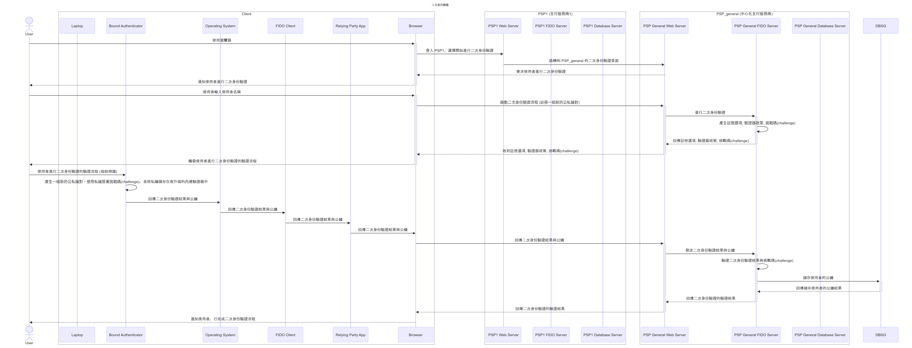
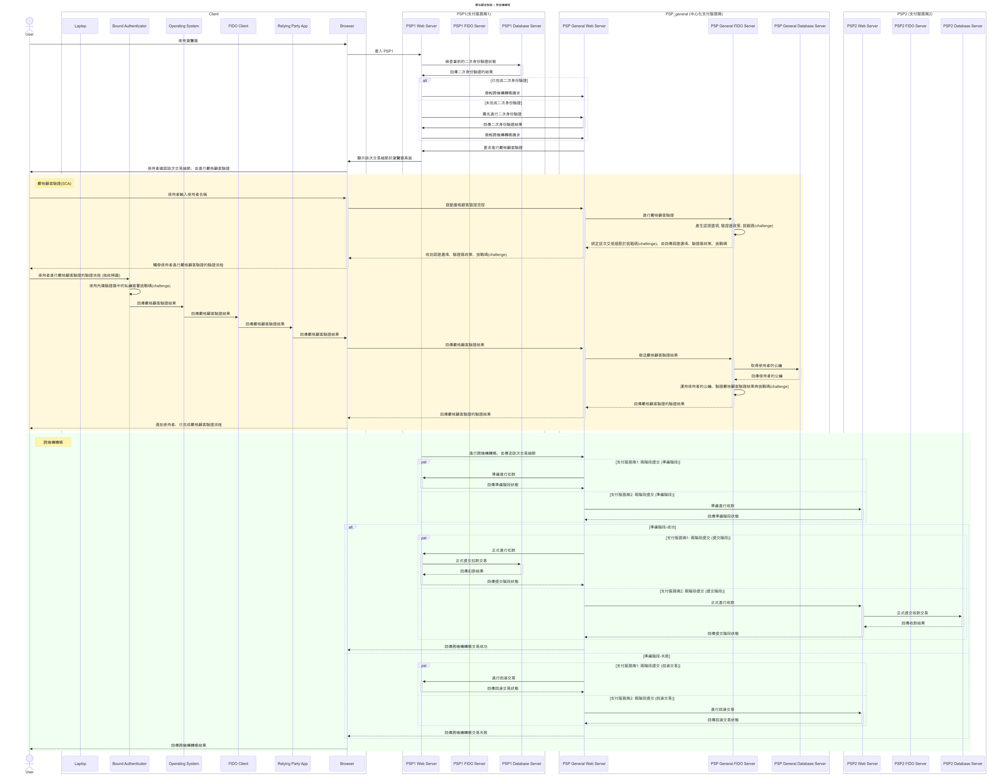

# 應用 FIDO 於支付服務商間交易的嚴格顧客驗證

## 摘要
- 數位化和網路科技快速發展，支付服務商成為推動電子商務和數位經濟的關鍵角色
- 資訊安全挑戰，尤其是在支付服務商間交易時，安全性及使用者身份的準確驗證問題尤為重要
- 現行做法: 傳統密碼系統和簡訊動態密碼驗證，但這些方法存在安全漏洞和不便利性
- 金管會推動採用 FIDO 標準，目的是通過更現代化的認證方式，提升金融交易的安全性和用戶體驗
- 本論文提出結合 FIDO 標準與嚴格顧客驗證的方案，透過公私鑰加密技術提升支付服務商間交易的安全

## 系統實作
- 模擬支付服務商間轉帳服務，基於 FIDO 與 Webauthn 標準建立中心化依賴方
- 使用者於中心化依賴方建立第二組公私鑰，作為二次身分驗證的基礎
- 每次執行跨機構轉帳，皆需進行嚴格顧客驗證，並且於挑戰碼中綁定交易細節
- 此系統實踐嚴格顧客驗證的安全機制，旨在提升支付服務商間交易的安全性

## 系統架構
### 支付服務商 (PSP)
- rp_general: https://rp-general.localhost:1000/psp_general
- rp1: https://rp1.localhost:3000/psp1
- rp2: https://rp2.localhost:4000/psp2

### 系統架構設計

### 系統流程設計
#### 系統註冊

#### 系統認證

#### 二次身份驗證

#### 嚴格顧客驗證與跨機構轉帳

## 目前進度
- [x] 新的 SCA + inter-psp transfer 流程的系統實作

## 尚待完成
- [ ] 針對需要在論文的 ch4 系統實作呈現的部分，前端畫面優化 (可嘗試用 React 框架來改寫)
- [ ] 針對需要在論文的 ch4 系統實作呈現的部分，作後端程式碼優化 (refactor)
- [x] 修正 isVerified、嚴格顧客驗證相關的變數命名、API 名稱、DB schema => 二次身份驗證
- [x] 修正 DB schema - Transfer 資料表的欄位名稱 (producer, consumer)
- [x] 刪除 RPC 相關程式碼
- [x] 檢查 SCA + 跨機構轉帳功能的 bug 在哪
- [x] 優化 psp_general 的 SCA & 跨機構轉帳 頁面
- [ ] FIDO UAF != 框架, 標準, 協定, 規範
- [x] 補充: localhost 的 origin 設計
- [x] 論文: 程式碼設計中，補上 localhost origin 切割的方式，以及 openssl 的自發簽證說明，以遵守 Webauthn 要求的 HTTPS 規範
- [x] 論文: 系統限制包含 origin, 生物辨識的方法, SCA 的適用情境、豁免情境
- [x] 論文: 修改所有引用，採用 title, subtitle 的表示方式
- [x] 論文: 思考關於 CORS 的兩張圖片，是否仍需要出現在論文中

## 參考文章
- [MySQL 官方文件: 2PC: XA Transaction States](https://dev.mysql.com/doc/refman/8.4/en/xa-states.html)
- [資料庫層擴展難題 - MySQL 分散式事務處理](https://mark-lin.com/posts/20190928/)
- [Chrome for Developers: SPC + Transaction Confirmation (透過安全付款確認機制進行驗證)](https://developer.chrome.com/docs/payments/authenticate-secure-payment-confirmation?hl=zh-tw)
- [Chrome for Developers: SPC + Transaction Confirmation (註冊安全付款確認)](https://developer.chrome.com/docs/payments/register-secure-payment-confirmation?hl=zh-tw)
- [Chrome for Developers: SPC + Transaction Confirmation (安全付款確認)](https://developer.chrome.com/docs/payments/secure-payment-confirmation?hl=zh-tw)
