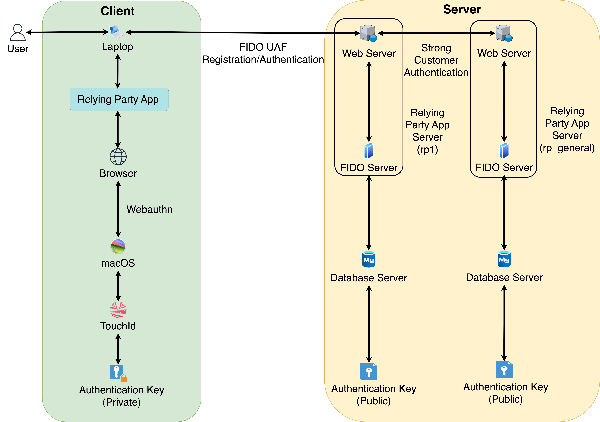
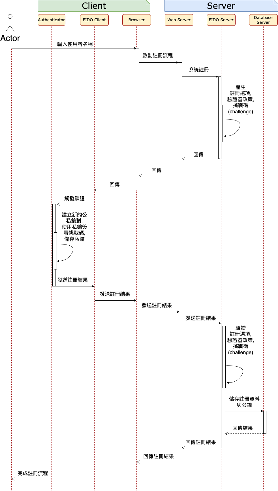

# 應用 FIDO 於支付服務商間交易的嚴格顧客驗證

## 摘要
- 數位化和網路科技快速發展，支付服務商成為推動電子商務和數位經濟的關鍵角色
- 資訊安全挑戰，尤其是在支付服務商間交易時，安全性及使用者身份的準確驗證問題尤為重要
- 現行做法: 傳統密碼系統和簡訊動態密碼驗證，但這些方法存在安全漏洞和不便利性
- 金管會推動採用 FIDO 標準，目的是通過更現代化的認證方式，提升金融交易的安全性和用戶體驗
- 本論文提出結合 FIDO 標準與嚴格顧客驗證的方案，透過公私鑰加密技術提升支付服務商間交易的安全

## 系統實作
- 模擬支付服務商間轉帳服務，基於 FIDO 與 Webauthn 標準，建立中心化依賴方
- 使用者於中心化依賴方建立第二組公私鑰，作為二次身分驗證的基礎
- 每次執行跨機構轉帳，皆需進行嚴格顧客驗證，並且於挑戰碼中綁定交易細節
- 此系統實踐嚴格顧客驗證的安全機制，旨在提升支付服務商間交易的安全性

## 系統架構
### OpenSSL 自發證書
- 設定本地端 `/etc/hosts` 的 DNS 文件
    ```
    # FIDO Inter-PSP Transfer
    127.0.0.1 rp1.localhost
    127.0.0.1 rp2.localhost
    127.0.0.1 rp-general.localhost
    ```

- 在本地端開發環境，使用 OpenSSL 自發證書
    - 建立 RSA 私鑰 (private key)
        ```bash
        openssl genrsa -out openssl.key 2048
        ```

    - 建立自發簽名請求的檔案 (CSR)
        ```bash
        openssl req -new -key openssl.key -out openssl.csr -config openssl.conf
        ```

    - 建立自發證書 (Certificate)
        ```bash
        openssl x509 -req -in openssl.csr -signkey openssl.key -out openssl.crt -days 365 -sha256 -extfile openssl.conf -extensions v3_req
        ```

- macOS 設定自發證書 (CA) 永遠信任
    - 將自發證書 (CA) 複製到<strong>鑰匙圈存取</strong>
        -  `/Library/Keychains/System.keychain`
    - 開啟鑰匙圈存取的目錄，找到自發證書 (CA)，點選右鍵選擇「信任」，並設定為 **「永遠信任」**

### 支付服務商 (PSP)
- rp_general: https://rp-general.localhost:1000/psp_general
- rp1: https://rp1.localhost:3000/psp1
- rp2: https://rp2.localhost:4000/psp2

### 系統架構設計


### 系統流程設計
#### 系統註冊


#### 系統認證


#### 二次身份註冊與驗證


#### 嚴格顧客驗證與跨機構轉帳


## 補充: FIDO Passkey 未來研究方向
- 目前 FIDO 在理論研究上雖然已逐漸完善，但實際生活中仍有許多情境值得考量導入 FIDO 驗證機制
- 參考 FIDO 通行密鑰（Passkey）官方使用情境，以下為提出未來可能的研究方向，期望 FIDO 在未來能夠更廣泛應用於各種場景，能提升整體資訊安全，以及使用者便利性

### 使用者
- 在使用者方面，FIDO 的應用能<strong>提升使用者在日常數位生活中的安全性與便利性</strong>
- 未來研究可著重於<strong>如何優化 FIDO 認證技術在各種使用者裝置上的應用</strong>，包括智慧型手機、平板電腦、智慧型家電用品
- 尤其是<strong>如何運用 FIDO 通行密鑰來取代傳統密碼</strong>，使得消費者在網購、社交媒體及日常應用中的<strong>登入過程更加簡便且安全</strong>
- 此外，<strong>針對不同年齡層和技術接受度的使用者群體，開發更友善、更易操作的 FIDO 認證介面</strong>也是未來研究的重點

### 企業
- 在企業環境中，FIDO 認證可以<strong>有效提升內部系統及數據的安全性，並簡化員工的身份驗證過程</strong>
- 未來研究應聚焦於<strong>如何在企業中廣泛應用 FIDO 認證技術</strong>，包括員工登入公司內部系統、遠端工作、存取機敏資料時的相關資訊安全措施
- 此外，還可以探討<strong>如何結合 FIDO 認證與現有的企業安全架構</strong>，例如: 零信任架構，以打造更完整的安全生態系統
- 同時，如何<strong>降低企業實施 FIDO 認證的成本及技術門檻，使得中小企業也能夠受益於這一技術</strong>，亦是未來研究的重要方向

### 政府
- 對於政府部門，FIDO 認證技術能<strong>提升公共服務的安全性與效率</strong>
- 未來研究可以<strong>探討 FIDO 認證在政府服務中的應用</strong>，包括身份認證、資料保護、數位簽名等方面
- 舉例來說，當<strong>建置 MyData 平台</strong>時，<strong>如何運用 FIDO 認證來保障安全地使用或共享個人資料，確保個人資料的隱私性和安全性</strong>，是一個重要的研究課題
- 政府部門還可以透過<strong>制定標準和政策</strong>，推動 FIDO 認證技術在更多領域的應用，以提升整體社會的數位安全水平

### 支付
- 在金融領域，FIDO 技術能<strong>提升支付交易的安全性與使用者體驗</strong>
- 未來研究可以探討該<strong>如何進一步應用 FIDO 技術於各種支付場景中</strong>，例如: 線上支付、移動支付、跨境支付
- 研究應著重於<strong>如何在支付過程中運用 FIDO 進行快速且安全的身份驗證，並且在降低詐騙風險的同時，提升使用者的支付體驗</strong>
- 此外，<strong>應考量如何將 FIDO 與其他技術結合</strong>，形成一個更全面的金融安全解決方案

## 參考文章
- [MySQL 官方文件: 2PC: XA Transaction States](https://dev.mysql.com/doc/refman/8.4/en/xa-states.html)
- [資料庫層擴展難題 - MySQL 分散式事務處理](https://mark-lin.com/posts/20190928/)
- [Chrome for Developers: SPC + Transaction Confirmation (透過安全付款確認機制進行驗證)](https://developer.chrome.com/docs/payments/authenticate-secure-payment-confirmation?hl=zh-tw)
- [Chrome for Developers: SPC + Transaction Confirmation (註冊安全付款確認)](https://developer.chrome.com/docs/payments/register-secure-payment-confirmation?hl=zh-tw)
- [Chrome for Developers: SPC + Transaction Confirmation (安全付款確認)](https://developer.chrome.com/docs/payments/secure-payment-confirmation?hl=zh-tw)
- [FIDO: Passkey Use Cases](https://fidoalliance.org/passkey-use-case/)